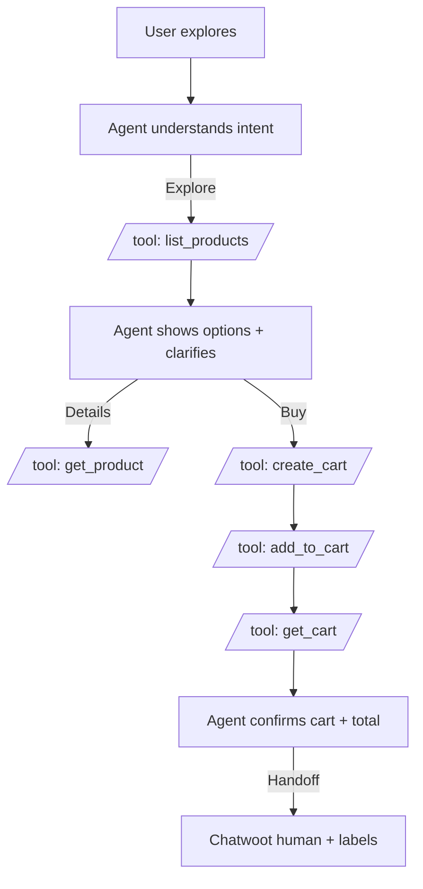

# Laburen Challenge – MCP + Agent (Concept)

## Flow

## Tools (MCP)
- list_products(query?, limit?, offset?)
- get_product(product_id)
- create_cart(conversation_id)
- add_to_cart(cart_id, product_id, qty, conversation_id?)
- get_cart(cart_id)

## Notes
- 1 cart per conversation (create_cart is idempotent)
- add_to_cart validates stock and applies tiered unit price:
  - qty >= 200 => price_200
  - qty >= 100 => price_100
  - else => price_50
